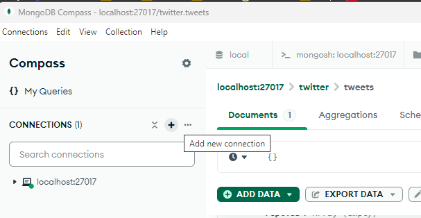
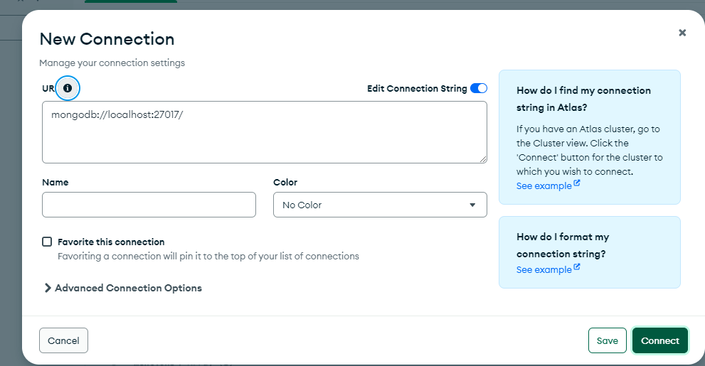
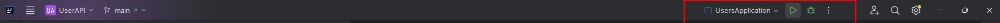

# UserAPI

UserApi es una interfaz de programación de aplicaciones (API) diseñada para gestionar operaciones relacionadas con
usuarios,
incluyendo la creación, seguimiento y bloqueo de usuarios en una red social simplificada.

## Tecnologías y Versiones

- **Java**: JDK 17 o superior
- **Spring Boot**: 3.3.3 o superior
- **Maven**: 3.9.5 o superior
- **Database**: MongoDB 7.0.14
- **Kafka**: 3.8.0

## Requisitos Previos

Antes de poder ejecutar `UserApi`, asegúrate de tener instalado lo siguiente:

- JDK 17 o superior: [Descargar JDK](https://www.oracle.com/java/technologies/javase-jdk11-downloads.html)
- Maven 3.9.5 superior: [Descargar Maven](https://maven.apache.org/download.cgi)
- MongoDB 7.0.14: [Instalación de MongoDB](https://www.mongodb.com/try/download/community)
- Apache Kafka 3.8.0: [Instalación de Kafka](https://kafka.apache.org/downloads) - Binary downloads: Scala 2.12

## Configuración

Configura las propiedades de la aplicación en el archivo `src/main/resources/application.properties`:

```properties
spring.data.mongodb.uri=mongodb://localhost:27017/userdb
spring.kafka.bootstrap-servers=localhost:9092
```

## Levantar la API Localmente

### Iniciar MongoDB

```
Abrir MongoDB compass

add new conetion 

Connect

```

### Iniciar Apache Kafka

```
**Importante para window dejar la carpeta a una altura cerca de C:**
**Ejemplo C:\Kafka o E:\kafka**
**Desde la raiz de la carpeta kafka ejecutamos**

---Windows---

# Iniciar el servidor ZooKeeper
bin\windows\zookeeper-server-start.bat config\zookeeper.properties

# Iniciar el servidor Kafka
bin\windows\kafka-server-start.bat config\server.properties

---MacOS---
# Iniciar el servidor ZooKeeper
bin/zookeeper-server-start.sh config/zookeeper.properties

# Iniciar el servidor Kafka
bin/kafka-server-start.sh config/server.properties

```

### Construir y Ejecutar la Aplicación: Desde el directorio raíz de tu proyecto, ejecuta:

```
mvn clean install
mvn spring-boot:run

o desde intellij



```

## Uso de la API

### crear Usuario

```
curl -X POST -H "Content-Type: application/json" -d '{"nickName": "johnDoe", "email": "john@example.com"}' http://localhost:8080/users
```

### Obtener Usuarios

```
curl -X GET http://localhost:8080/users
```


## Uso de la API

### Swagger

- Esta disponible un [Swagger_UI](http://localhost:8081/swagger-ui/index.html#/) para poder visualizar los
  recursos disponibles y probarlos
- Adicionalemente en la carpeta de documentation ubicada en la raiz del proyecto se observara una carpeta de postman en
  en donde tendre unas collections y environment que podemos [importar](https://learning.postman.com/docs/getting-started/importing-and-exporting/importing-data/)
  y probar la Api **Importante Validar que los puertos en el environment corresponda a donde esta levantada la API**